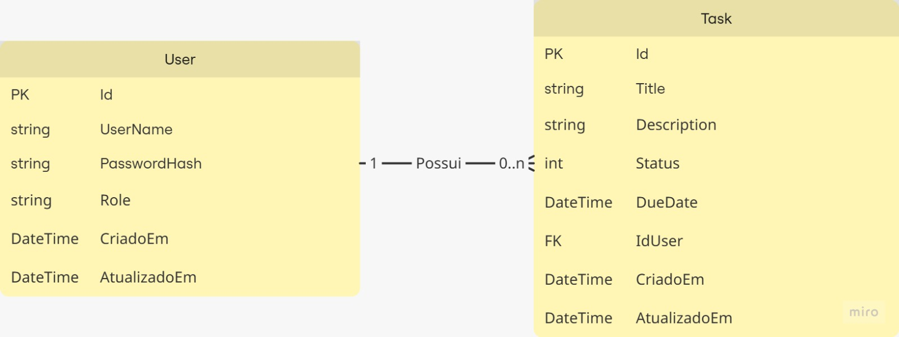

## Visão Geral

Esta API RESTful foi desenvolvida para um **sistema de gestão de tarefas colaborativas**, permitindo que usuários criem, editem, atribuam e concluam tarefas em um ambiente compartilhado. O objetivo é facilitar o acompanhamento de responsabilidades entre membros de uma equipe, promovendo organização, produtividade e colaboração. 

A aplicação é construída em **C# com .NET**, utilizando arquitetura **monolítica modular em camadas**, com **SQL Server** como banco de dados relacional.

---

## Decisões Arquiteturais

A arquitetura da aplicação foi definida como **monolito modular em camadas**, promovendo organização, escalabilidade e separação de responsabilidades, cada modulo possui as seguintes camadas:

- **Camada de Api (Controllers)**: Responsável por expor os endpoints HTTP da API. 
- **Camada de Domínio**: Contém a lógica de negócio da aplicação, também define as entidades, interfaces e regras de domínio.
- **Camada de Infraestrutura**: Implementa os repositórios, integrações externas (como acesso a banco de dados) e classes que serão reutilizadas dentro de outras camadas.

### Padrões e boas práticas aplicados:

- **RESTful API** para padronização das rotas e operações HTTP.
- **Repository Pattern** para abstração da persistência de dados.
- **DTOs** para isolamento entre as camadas de transporte e domínio.
- **Injeção de Dependência** para promover baixo acoplamento.
- **Validações com FluentValidation** (se aplicável).
- **Logs e tratativas de exceções padronizadas**.

---

## Modelagem de Dados

O sistema utiliza o **SQL Server** como banco de dados relacional.

### Tabelas principais:

- `User`: Armazena informações dos usuários do sistema.
- `Tasks`: Representa as tarefas criadas pelos usuários. 



---

## Fluxo de Requisições

A seguir, alguns dos principais endpoints da API RESTful:

### Auth
- `POST /auth/login`: Login de usuários, retornando um token JWT.

### Users
- `POST /users`: Criação de novo usuário.
- `GET /users/{id}`: Obter informações de um usuário específico.
- `PUT /users/{id}`: Atualizar informações do usuário.
- `DELETE /users/{id}`: Remover um usuário (soft delete) 

### Tasks
- `POST /tasks`: Criação de nova tarefa. 
- `GET /tasks/{id}`: Obter detalhes de uma tarefa.
- `GET /tasks?assignedTo={userId}`: Listar todas as tarefas atribuídas a um usuário.
- `PUT /tasks/{id}`: Atualização da tarefa.
- `DELETE /tasks/{id}`: Exclusão da tarefa.  

> Todas as rotas seguem convenções REST e retornam códigos de status HTTP apropriados.

--- 

### Requisitos

- [.NET SDK 8.0+](https://dotnet.microsoft.com/)
- [SQL Server 2019+](https://www.microsoft.com/sql-server)
- Visual Studio 2022 ou VS Code

### Passos para execução local

1. Clone o repositório:
   ```bash
   git clone https://github.com/mgehring-dev/gestao-de-tarefas-api.git
   cd gestao-de-tarefas-api
